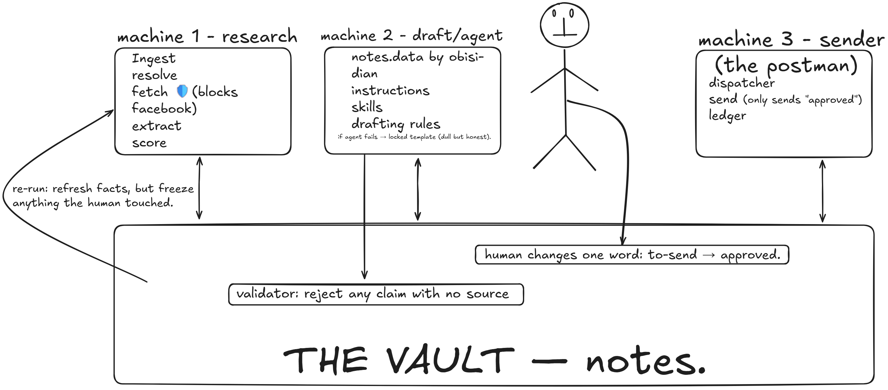

# Prospector

Prospector is a command-line research and outreach-drafting pipeline for local
service businesses. It turns a CSV or Markdown company list into an Obsidian
vault containing sourced research, personalized drafts, review queues, and an
approval-controlled sending workflow.

The system is designed around human approval and verifiable claims. It never
contacts Facebook, never invents a prospect's name, and never sends a message
unless a user explicitly approves the corresponding note.

> Prospector was initially built for duct-cleaning outreach, but the pipeline
> can be adapted to other local-service verticals.



## Contents

- [Capabilities](#capabilities)
- [Safety guarantees](#safety-guarantees)
- [How it works](#how-it-works)
- [Installation](#installation)
- [Configuration](#configuration)
- [Usage](#usage)
- [Input format](#input-format)
- [Review workflow](#review-workflow)
- [Sending approved drafts](#sending-approved-drafts)
- [Output](#output)
- [Design principles](#design-principles)
- [Limitations](#limitations)

## Capabilities

- Ingest CSV files and Markdown tables.
- Deduplicate shared inboxes and classify email and Messenger prospects.
- Resolve missing websites through Google Places or DuckDuckGo.
- Research public company pages with bounded retries, host pacing, and
  `robots.txt` support.
- Extract names, locations, hooks, and open-web Facebook signals with evidence.
- Score evidence deterministically before it reaches the drafting model.
- Produce cited drafts with a locked-template fallback.
- Write one Markdown note per company and a Dataview-compatible dashboard.
- Preserve human-owned content across repeated runs.
- Deliver approved drafts through Gmail or authenticated SMTP with dry-run
  defaults, daily caps, pacing, and duplicate-send protection.
- Assist manual Messenger delivery: copy an approved draft to the clipboard and
  open the prospect's Facebook page in your own browser — you send it yourself.

## Safety guarantees

These constraints are enforced in code and tests. See
[`.specify/memory/constitution.md`](.specify/memory/constitution.md) for the
complete project principles.

| Guarantee | Enforcement |
| --- | --- |
| Human approval is required | `prospector send` considers only notes with `status: approved`. It previews by default; real delivery requires `--send` and confirmation unless `--yes` is supplied. |
| Facebook is never contacted | All outbound HTTP traffic passes through a guard that rejects Facebook and Messenger hosts before network activity. Facebook URLs are stored only as input/target signals. Assisted Messenger delivery (`prospector dm`) never sends a message or automates a browser — it hands the URL to your own browser, and you send it yourself. |
| Names are never fabricated | Deterministic code extracts and scores names. Only high-confidence, source-backed names are used; the model does not choose the greeting. |
| Prospect claims require evidence | Every agent-written prose block cites captured research records. A deterministic validator rejects missing or invalid citations. |
| Unsupported claims are rejected | Invalid or unverifiable copy is rejected and replaced with a locked template. |
| Sending is identity-bound | The authenticated identity must match the dedicated mailbox configured in `PROSPECTOR_SEND_FROM`. |
| The vault is the interface | Research, drafts, approvals, and review queues remain in plain Markdown; there is no web application. |

## How it works

```text
Company list
    |
    v
Ingest -> deduplicate -> resolve -> fetch -> extract -> score -> draft
                                                               |
                                                               v
                                                        Obsidian vault
                                                               |
                                                     human review/approval
                                                               |
                                                               v
                                                   Gmail API or SMTP
```

The pipeline has three operational stages:

1. **Research** collects public information and records a source for each fact.
2. **Draft** generates copy from evidence records, validates its citations, and
   uses a locked template when validation fails.
3. **Send** delivers only human-approved notes, subject to identity checks,
   configured limits, and an append-only ledger.

Stages communicate through the Obsidian vault. Re-running the pipeline refreshes
tool-owned fields while preserving approval decisions, logs, and custom
sections.

### Pipeline details

1. **Ingest and deduplicate** - Parse input, normalize rows, and group genuinely
   shared inboxes.
2. **Classify channels** - Route valid emails to email. Blank values,
   `messenger`, and Facebook URLs enter the Messenger draft queue.
3. **Resolve websites** - Use Google Places when configured, with a DuckDuckGo
   fallback during `run`.
4. **Fetch pages** - Read the homepage and relevant About, Team, and Contact
   pages.
5. **Extract evidence** - Identify name candidates, locations, hooks, and
   Facebook usage signals with source excerpts.
6. **Score evidence** - Apply deterministic confidence and channel-fit rules.
7. **Draft and validate** - Send only structured evidence to OpenRouter, then
   validate every returned citation and claim.
8. **Write the vault** - Create or update company notes and `_Dashboard.md`
   without overwriting human-owned content.

## Installation

Prospector requires Python 3.11 or later.

```bash
git clone https://github.com/anusbutt/Prospector.git
cd Prospector
python -m venv .venv
```

Activate the environment:

```bash
# macOS/Linux
source .venv/bin/activate

# Windows PowerShell
.venv\Scripts\Activate.ps1
```

Install the package and create a local configuration file:

```bash
pip install -e .
cp .env.example .env
```

On Windows PowerShell, use `Copy-Item .env.example .env` instead of `cp`.

## Configuration

Secrets are loaded from the gitignored `.env` file.

| Variable | Required | Description |
| --- | --- | --- |
| `OPENROUTER_API_KEY` | For drafting | OpenRouter credential. Omit only with `--no-llm`. |
| `OPENROUTER_MODEL` | No | Defaults to `anthropic/claude-sonnet-4.5`. |
| `GOOGLE_PLACES_API_KEY` | For `source` | Required for discovery. During `run`, its absence enables the DuckDuckGo fallback. |
| `HUNTER_API_KEY` | No | Enables email-name enrichment at medium confidence. |
| `PROSPECTOR_SEND_PROVIDER` | No | `gmail` (default) or `smtp`. |
| `PROSPECTOR_SEND_FROM` | For `send` | Dedicated address; must match the authenticated identity. |
| `PROSPECTOR_SEND_NAME` | No | Display name for the `From` header. |
| `PROSPECTOR_REPLY_TO` | No | Optional `Reply-To` address. |
| `PROSPECTOR_SMTP_HOST` | For SMTP | SMTP server hostname. |
| `PROSPECTOR_SMTP_USERNAME` | For SMTP | SMTP login; must match `PROSPECTOR_SEND_FROM`. |
| `PROSPECTOR_SMTP_PASSWORD` | For SMTP | SMTP or app-specific password. |
| `PROSPECTOR_SMTP_SECURITY` | No | `ssl` (default) or `starttls`. |
| `PROSPECTOR_SMTP_PORT` | No | Defaults to `465` for SSL or `587` for STARTTLS. |
| `PROSPECTOR_SEND_CAPS` | No | Weekly cap ramp; defaults to `15,30,60,100`. |
| `PROSPECTOR_SEND_DELAY` | No | Delay range in seconds; defaults to `30,90`. |
| `PROSPECTOR_LEDGER` | No | Ledger path; defaults to `send_ledger.jsonl`. |

Gmail OAuth files live under `secrets/`; the send ledger remains local. Both
locations are excluded from version control.

## Usage

### Process a company list

```bash
prospector run companies.csv
prospector run companies.csv --vault ~/Obsidian/Outreach
prospector run companies.csv --limit 3
prospector run companies.csv --only summit-duct-care
prospector run companies.csv --no-llm
```

The default output directory is `Vault/Outreach`.

### Refresh the dashboard

```bash
prospector dashboard
prospector dashboard --vault ~/Obsidian/Outreach
```

### Discover companies

```bash
prospector source
prospector source --limit 2 --all --verbose
prospector source --keyword 'air duct cleaning' --metros my_metros.txt
prospector source --out candidates.csv --max-queries 30
```

`source` uses Google Places Text Search, deduplicates results, fetches each
candidate's own website, and checks retrieved markup for Meta Pixel signals
without contacting Facebook. By default it writes pixel-positive candidates;
use `--all` to retain every result. Pixel presence is a sourcing filter, not
evidence that a company currently runs advertisements.

### Preview or send approved drafts

```bash
prospector send
prospector send --send
prospector send --send --limit 5
prospector send --send --vault ~/Obsidian/Outreach
prospector send --send --yes
```

`prospector send` is a dry-run unless `--send` is present.

### Deliver approved Messenger drafts (assisted-manual)

```bash
prospector dm
prospector dm --send
prospector dm --send --limit 5
prospector dm --send --yes
```

`prospector dm` walks approved `channel: messenger` notes one at a time. With
`--send`, for each note it copies the draft to your clipboard and opens the
company's Facebook page in your own browser; you paste, send it yourself, then
confirm. Confirmed deliveries are recorded in `dm_ledger.jsonl` (so a prospect is
never queued twice) and the note flips to `sent`. Without `--send` it only
previews. The tool never sends a Messenger message, never automates a browser,
and never contacts Facebook — only your browser does. Notes with no Facebook link
on file are still shown so you can locate the company manually.

### Exit codes

| Command | Code | Meaning |
| --- | ---: | --- |
| `run`, `source` | `0` | Batch completed; individual failures may be reported. |
| `run`, `source` | `1` | Pre-flight failure; nothing was written. |
| `run`, `source` | `2` | Unexpected mid-run failure; valid output remains. |
| `send` | `0` | Operation completed; per-message failures are reported. |
| `send` | `1` | Configuration or pre-flight failure. |
| `send` | `2` | Authenticated identity does not match the configured sender. |
| `send` | `3` | Gmail OAuth or SMTP authentication failed. |

## Input format

Input may be CSV or a Markdown table. `company` and `email` are required;
`website`, `facebook_url`, `city`, `owner_name`, and `notes` are
optional. Headers are case-insensitive. Unknown columns produce a warning, and
malformed rows are reported without aborting the batch.

```csv
company,email,website,city,owner_name,notes
Summit Duct Care,info@summitduct.example.com,summitduct.example.com,Denver,,
Peak Vent Cleaning,messenger,,Boulder,,prefers DMs
Alpine Air Ducts,https://facebook.com/alpineairducts,,Fort Collins,,
Mile High Ducts,scott@milehighducts.example.com,milehighducts.example.com,,Scott Bell,referral
Mile High Dryer Vents,scott@milehighducts.example.com,milehighducts.example.com,Denver,,same owner
```

### Evidence scoring

| Name confidence | Draft behavior |
| --- | --- |
| `high` | Uses a source-backed first name from explicit owner text, an About or Team page, an unambiguous email pattern, or human input. |
| `medium` | Keeps the company-team greeting, stores the candidate, and flags the note for review. |
| `none` | Uses the company-team greeting. |

Site-extracted candidates must also match the bundled US first-name list.
Conservative rejection is preferred over an incorrect greeting.

| Facebook signal | Rule | Draft behavior |
| --- | --- | --- |
| `strong` | At least two signals, including an active-use indicator | Facebook-specific variant. |
| `weak` | One signal, or presence without activity | Channel-neutral copy with one conditional mention. |
| `none` | No observed signal | Channel-neutral copy without a Facebook mention. |

Signals come from the open web; the Facebook page itself is never requested.
Uncertain evidence always scores down rather than up.

## Review workflow

1. Run `prospector run` against the company list.
2. Open the generated vault in Obsidian.
3. Review the **Needs review** queue and confirm or reject `name_candidate`
   values.
4. Review each draft in the **To send** queue.
5. Change `status: to-send` to `status: approved` when the message is ready.
6. Run `prospector send` to preview the batch.
7. Run `prospector send --send` to deliver it.
8. For `channel: messenger` notes, run `prospector dm --send` to be walked
   through assisted-manual delivery (clipboard + your browser; you send).

Prospector preserves user-edited statuses, `## Log` entries, and custom sections
across research runs. During real delivery, the only automatic user-visible
status transition is `approved` to `sent`.

`_Dashboard.md` uses the
[Dataview](https://blacksmithgu.github.io/obsidian-dataview/) Obsidian plugin
for live queues. Notes remain usable as ordinary Markdown without Dataview.

## Sending approved drafts

### SMTP

```dotenv
PROSPECTOR_SEND_PROVIDER=smtp
PROSPECTOR_SMTP_HOST=smtp.zoho.com
PROSPECTOR_SMTP_SECURITY=ssl
PROSPECTOR_SMTP_PORT=465
PROSPECTOR_SMTP_USERNAME=outreach@example.com
PROSPECTOR_SMTP_PASSWORD=<app-specific-password>
PROSPECTOR_SEND_FROM=outreach@example.com
PROSPECTOR_SEND_NAME=Example Outreach
```

Authentication is mandatory, TLS certificates are verified, and the SMTP
username must match the sender address. See
[`specs/004-provider-transport/quickstart.md`](specs/004-provider-transport/quickstart.md)
for the complete setup guide.

### Gmail

Gmail is the default provider. Enable the Gmail API in a Google Cloud project,
create a Desktop OAuth client, and place its secret at
`secrets/gmail_client_secret.json`. The first real send opens OAuth consent and
stores the token at `secrets/gmail_token.json`. The authenticated account must
match `PROSPECTOR_SEND_FROM`.

### Delivery controls

For every real send, Prospector verifies the sender, checks the remaining daily
allowance, skips ledgered recipients and notes, delivers through the selected
provider, records the message ID, changes the note to `sent`, and waits for a
randomized interval.

Individual failures leave the affected note approved and do not stop the batch.
A stopped run can be resumed safely because the append-only ledger prevents
duplicate delivery.

## Output

Each company receives a stable, slug-keyed Markdown note:

```markdown
---
company: Summit Duct Care
email: info@summitduct.example.com
channel: email
status: to-send
name_used: team
name_confidence: none
name_candidate:
hook: Denver service area
website: summitduct.example.com
angle: offer-led
fb_signal: none
duplicate_of:
needs_review: false
draft_source: agent
outcome:
tags: [outreach, duct-cleaning, prospector]
---

## Draft
**Subject:** Example subject

Example draft body.

## Citations
1. `hook_source_1` - source excerpt and URL
2. `offer` - sender, product, or offer information

## Research
- Sources and extracted evidence
- Confidence and signal decisions
- Fetch or validation failures

## Log
-
```

Agent-written notes map their content to research records in `## Citations`.
Template-fallback notes omit this section because they make no
prospect-specific claims. `draft_source` identifies the drafting path, and
`outcome` is reserved for human tracking.

## Design principles

- **Deterministic trust boundary.** Confidence scoring, classification,
  citation resolution, and claim validation are implemented in Python. The
  model controls phrasing, not factual acceptance.
- **Evidence-limited drafting.** The model receives structured evidence rather
  than raw HTML; invalid output is discarded.
- **Human-owned state.** Approval, outcomes, logs, and custom content stay in
  readable Markdown and survive repeated runs.
- **Safe degradation.** Optional-service failures use documented fallbacks or
  reduce enrichment without weakening validation.
- **Spec-driven development.** Product intent is in [`PRODUCT.md`](PRODUCT.md),
  with implementation specifications under [`specs/`](specs/).

## Limitations

- Name extraction depends on what public websites disclose; lower-confidence
  candidates are flagged rather than guessed.
- Heuristics are optimized for English-language US local-service businesses.
- Drafting instructions in `prospector/agent/` and the fallback template are
  currently tailored to the duct-cleaning offer.
- Meta Pixel markup does not prove current advertising activity and is never
  presented as such.
- Deliverability depends on mailbox reputation, authentication, domain policy,
  message quality, and recipient behavior; application caps do not guarantee
  inbox placement.

## License

Prospector is available under the [MIT License](LICENSE).
