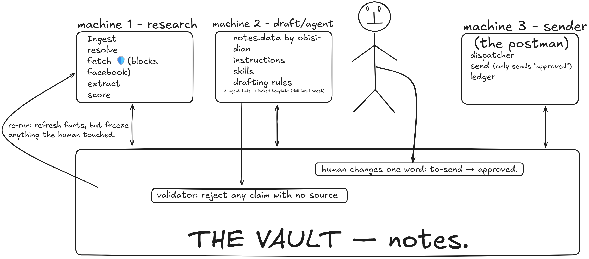

# Prospector

Prospector is a command-line research and outreach-drafting pipeline for local
service businesses. It turns a CSV or Markdown company list into an Obsidian
vault containing sourced research, personalized drafts, review queues, and an
approval-controlled sending workflow.

The system is designed around human approval and verifiable claims. It never
contacts Facebook, never invents a prospect's name, and never sends a message
unless a user explicitly approves the corresponding note.

The offer itself is not built in. Each vertical is a **profile** — a directory of
content selected with `--profile` — so serving a new niche means adding files,
not changing code. A `duct-cleaning` profile ships with the package as a working
reference.



## Contents

- [Capabilities](#capabilities)
- [Safety guarantees](#safety-guarantees)
- [How it works](#how-it-works)
- [Installation](#installation)
- [Running the CLI](#running-the-cli)
- [Configuration](#configuration)
- [Profiles](#profiles)
- [Usage](#usage)
- [Input format](#input-format)
- [Review workflow](#review-workflow)
- [Sending approved drafts](#sending-approved-drafts)
- [Output](#output)
- [Design principles](#design-principles)
- [Limitations](#limitations)

## Capabilities

- Ingest CSV files and Markdown tables.
- Deduplicate shared inboxes.
- Recover a published address from a company's own pages when the input row has
  none, and report by name any company that remains unreachable.
- Resolve missing websites through Google Places or DuckDuckGo.
- Research public company pages with bounded retries, host pacing, and
  `robots.txt` support.
- Extract names, locations, and hooks with evidence.
- Score evidence deterministically before it reaches the drafting model.
- Produce cited drafts with a locked-template fallback.
- Serve any vertical from a selectable profile, with no code change.
- Write one Markdown note per company and a Dataview-compatible dashboard.
- Preserve human-owned content across repeated runs.
- Deliver approved drafts through Gmail or authenticated SMTP with dry-run
  defaults, daily caps, pacing, and duplicate-send protection.

## Safety guarantees

These constraints are enforced in code and tests, and are treated as hard
requirements: a change that breaks one must be rejected. See
[`CONTRIBUTING.md`](CONTRIBUTING.md) for the rules contributors must preserve.

| Guarantee | Enforcement |
| --- | --- |
| Human approval is required | `prospector send` considers only notes with `status: approved`. It previews by default; real delivery requires `--send` and confirmation unless `--yes` is supplied. |
| Email is the only channel | There is no Messenger or Facebook delivery path in the tool, and no command that opens one. |
| Facebook is never contacted | All outbound HTTP traffic passes through a guard that rejects Facebook and Messenger hosts before network activity. Meta Pixel markup on a company's *own* site is read as a sourcing signal; the URLs inside it are never requested. |
| Names are never fabricated | Deterministic code extracts and scores names. Only high-confidence, source-backed names are used; the model does not choose the greeting. |
| No company is silently dropped | A row with no address gets an email-recovery attempt over pages already fetched; if that fails the company is named in the run summary. There is no third outcome. |
| Prospect claims require evidence | Every agent-written prose block cites captured research records. A deterministic validator rejects missing or invalid citations. |
| Unsupported claims are rejected | Invalid or unverifiable copy is rejected and replaced with the profile's locked template. |
| A broken profile stops the run | Profiles are validated in full before any company is processed; a malformed one exits 1 having fetched and written nothing. |
| Sending is identity-bound | The authenticated identity must match the dedicated mailbox configured in `PROSPECTOR_SEND_FROM`. |
| The vault is the interface | Research, drafts, approvals, and review queues remain in plain Markdown; there is no web application. |

## How it works

```text
Company list
    |
    v
Ingest -> deduplicate -> resolve -> fetch -> extract -> score -> draft
                                                               |
                                                               v
                                                        Obsidian vault
                                                               |
                                                     human review/approval
                                                               |
                                                               v
                                                   Gmail API or SMTP
```

The pipeline has three operational stages:

1. **Research** collects public information and records a source for each fact.
2. **Draft** generates copy from evidence records, validates its citations, and
   uses a locked template when validation fails.
3. **Send** delivers only human-approved notes, subject to identity checks,
   configured limits, and an append-only ledger.

Stages communicate through the Obsidian vault. Re-running the pipeline refreshes
tool-owned fields while preserving approval decisions, logs, and custom
sections.

### Pipeline details

1. **Select and validate the profile** - Resolve `--profile`, then validate it in
   full before any company is touched.
2. **Ingest and deduplicate** - Parse input, normalize rows, and group genuinely
   shared inboxes.
3. **Resolve websites** - Use Google Places when configured, with a DuckDuckGo
   fallback during `run`.
4. **Fetch pages** - Read the homepage and relevant About, Team, and Contact
   pages.
5. **Recover missing addresses** - For a row with no email, look for a published
   address in the pages already fetched. No new requests are made. A company with
   no usable address is skipped and named in the summary.
6. **Extract evidence** - Identify name candidates, locations, and hooks with
   source excerpts.
7. **Score evidence** - Apply deterministic confidence rules.
8. **Draft and validate** - Send only structured evidence to OpenRouter, then
   validate every returned citation and claim.
9. **Write the vault** - Create or update company notes and `_Dashboard.md`
   without overwriting human-owned content.

## Installation

Prospector requires Python 3.11 or later.

```bash
git clone https://github.com/anusbutt/Prospector.git
cd Prospector
python -m venv .venv
```

Activate the environment:

```bash
# macOS/Linux
source .venv/bin/activate

# Windows PowerShell
.venv\Scripts\Activate.ps1
```

Install the package and create a local configuration file:

```bash
pip install -e .
cp .env.example .env
```

On Windows PowerShell, use `Copy-Item .env.example .env` instead of `cp`.

## Running the CLI

With the virtual environment active, invoke the tool directly:

```bash
prospector --help
```

If `prospector` is not found — common when the environment cannot be activated,
for example when it was created under a different path — call the entry point by
its full path, or define a shell alias:

```bash
.venv/bin/prospector --help                          # always works
alias prospector='/absolute/path/to/Prospector/.venv/bin/prospector'
```

Run commands from the project directory: `.env`, `Vault/`, and
`send_ledger.jsonl` all resolve relative to the current working directory.

Windows users should install and run Prospector inside WSL rather than CMD or
PowerShell. The package lives in the Linux virtual environment, so `prospector`
does not exist at a Windows prompt.

## Configuration

Secrets are loaded from the gitignored `.env` file.

| Variable | Required | Description |
| --- | --- | --- |
| `OPENROUTER_API_KEY` | For drafting | OpenRouter credential. Omit only with `--no-llm`. |
| `OPENROUTER_MODEL` | No | Defaults to `anthropic/claude-sonnet-4.5`. |
| `PROSPECTOR_PROFILE` | No | Default profile name, so `--profile` can be omitted. |
| `PROSPECTOR_PROFILES` | No | Extra profile directory, searched before `./profiles/`. |
| `GOOGLE_PLACES_API_KEY` | For `source` | Required for discovery. During `run`, its absence enables the DuckDuckGo fallback. |
| `HUNTER_API_KEY` | No | Enables email-name enrichment at medium confidence. |
| `PROSPECTOR_SEND_PROVIDER` | No | `gmail` (default) or `smtp`. |
| `PROSPECTOR_SEND_FROM` | For `send` | Dedicated address; must match the authenticated identity. |
| `PROSPECTOR_SEND_NAME` | No | Display name for the `From` header. |
| `PROSPECTOR_REPLY_TO` | No | Optional `Reply-To` address. |
| `PROSPECTOR_SMTP_HOST` | For SMTP | SMTP server hostname. |
| `PROSPECTOR_SMTP_USERNAME` | For SMTP | SMTP login; must match `PROSPECTOR_SEND_FROM`. |
| `PROSPECTOR_SMTP_PASSWORD` | For SMTP | SMTP or app-specific password. |
| `PROSPECTOR_SMTP_SECURITY` | No | `ssl` (default) or `starttls`. |
| `PROSPECTOR_SMTP_PORT` | No | Defaults to `465` for SSL or `587` for STARTTLS. |
| `PROSPECTOR_SEND_CAPS` | No | Weekly cap ramp; defaults to `15,30,60,100`. |
| `PROSPECTOR_SEND_DELAY` | No | Delay range in seconds; defaults to `30,90`. |
| `PROSPECTOR_LEDGER` | No | Ledger path; defaults to `send_ledger.jsonl`. |

Gmail OAuth files live under `secrets/`; the send ledger remains local. Both
locations are excluded from version control.

## Profiles

A profile holds everything specific to one vertical and one offer. Nothing about
a particular offer is compiled into the code.

```text
profiles/<name>/
├── IDENTITY.md              who the sender is
├── OFFER.md                 what is being offered
├── CONSTRAINTS.md           hard rules for the drafting model
├── skills/
│   └── write-cold-email.md  writing guidance
├── fallback.md              the locked template: ## Subject, ## Template, ## Invariants
└── profile.toml             tags, signature, product_url, keywords, banned_claims
```

Select one per run:

```bash
prospector run companies.csv --profile duct-cleaning
prospector run companies.csv                          # lists profiles and asks
```

Omitting `--profile` prompts interactively. A non-interactive run (CI, a pipe,
cron) fails with the available names rather than blocking on a prompt nobody can
answer. Set `PROSPECTOR_PROFILE` to skip the question entirely.

### Adding a vertical

No code changes are required. Copy the bundled reference into your own
`./profiles/` directory and edit it:

```bash
mkdir -p profiles
cp -r "$(python -c 'import prospector,pathlib;print(pathlib.Path(prospector.__file__).parent/"profiles"/"duct-cleaning")')" profiles/hvac
```

Edit the files in `profiles/hvac/`, then run it:

```bash
prospector run leads.csv --profile hvac
```

`source` picks up the profile's first keyword as its default search term, notes
are tagged from `tags`, and the drafted copy carries that profile's signature and
its single promotional link.

Profiles resolve from `$PROSPECTOR_PROFILES`, then `./profiles/`, then the
profiles bundled with the package — so your own directory always wins. A profile
you place in `./profiles/duct-cleaning/` shadows the bundled one; the bundled
copy is never modified, so it stays a clean reference.

Every profile is validated in full before any company is processed. A missing
file, a `fallback.md` without its three sections, a missing `profile.toml` key, or
an oversized instruction assembly exits 1 naming the profile and the problem,
having fetched and written nothing. Validation never falls back to another
profile.

Profiles are content, not a way around the guarantees: they cannot grant the
model tools, network, or filesystem access, and cannot disable citation
validation, the locked fallback, approval-gated sending, or the Facebook host
guard. They must never contain secrets.

## Usage

### Process a company list

```bash
prospector run companies.csv --profile duct-cleaning
prospector run companies.csv --profile duct-cleaning --vault ~/Obsidian/Outreach
prospector run companies.csv --profile duct-cleaning --limit 3
prospector run companies.csv --profile duct-cleaning --only summit-duct-care
prospector run companies.csv --profile duct-cleaning --no-llm
```

The default output directory is `Vault/Outreach`.

The run summary reports how many addresses were recovered and names every
company left without one:

```text
Prospector run: 40 companies
  processed: 33   failed: 0
  email recovered: 6   no email found: 7

  no email found:
    summit-duct-care     no published address on any fetched page
    peak-vent-cleaning   no website could be resolved
```

### Refresh the dashboard

```bash
prospector dashboard
prospector dashboard --vault ~/Obsidian/Outreach
```

### Discover companies

```bash
prospector source --profile duct-cleaning
prospector source --profile duct-cleaning --limit 2 --all --verbose
prospector source --keyword 'air duct cleaning' --metros my_metros.txt
prospector source --out candidates.csv --max-queries 30
```

Without `--keyword`, the profile's first keyword is used.

`source` uses Google Places Text Search, deduplicates results, fetches each
candidate's own website, and checks retrieved markup for Meta Pixel signals
without contacting Facebook. By default it writes pixel-positive candidates;
use `--all` to retain every result. Pixel presence is a sourcing filter, not
evidence that a company currently runs advertisements.

### Preview or send approved drafts

```bash
prospector send
prospector send --send
prospector send --send --limit 5
prospector send --send --vault ~/Obsidian/Outreach
prospector send --send --yes
```

`prospector send` is a dry-run unless `--send` is present.

### Exit codes

| Command | Code | Meaning |
| --- | ---: | --- |
| `run`, `source` | `0` | Batch completed; individual failures may be reported. |
| `run`, `source` | `1` | Pre-flight failure; nothing was written. |
| `run`, `source` | `2` | Unexpected mid-run failure; valid output remains. |
| `send` | `0` | Operation completed; per-message failures are reported. |
| `send` | `1` | Configuration or pre-flight failure. |
| `send` | `2` | Authenticated identity does not match the configured sender. |
| `send` | `3` | Gmail OAuth or SMTP authentication failed. |

## Input format

Input may be CSV or a Markdown table. `company` is required; `email`, `website`,
`city`, `owner_name`, and `notes` are optional. Headers are case-insensitive.
Unknown columns produce a warning, and malformed rows are reported without
aborting the batch.

A row with no usable address is not dropped: if a website can be resolved, the
tool looks for a published address on the pages it already fetched. Anything in
the `email` column that is not a valid address — a blank, the word `messenger`, a
Facebook URL — is treated as "no address supplied" and takes that same path.

```csv
company,email,website,city,owner_name,notes
Summit Duct Care,info@summitduct.example.com,summitduct.example.com,Denver,,
Peak Vent Cleaning,,peakvent.example.com,Boulder,,address recovered from site
Alpine Air Ducts,,,Fort Collins,,no site; will be reported as skipped
Mile High Ducts,scott@milehighducts.example.com,milehighducts.example.com,,Scott Bell,referral
Mile High Dryer Vents,scott@milehighducts.example.com,milehighducts.example.com,Denver,,same owner
```

### Evidence scoring

| Name confidence | Draft behavior |
| --- | --- |
| `high` | Uses a source-backed first name from explicit owner text, an About or Team page, an unambiguous email pattern, or human input. |
| `medium` | Keeps the company-team greeting, stores the candidate, and flags the note for review. |
| `none` | Uses the company-team greeting. |

Site-extracted candidates must also match the bundled US first-name list.
Conservative rejection is preferred over an incorrect greeting.

The drafted copy makes no claim about a prospect's own marketing channels, so
uncertain evidence about them cannot leak into a message. Uncertain evidence
always scores down rather than up.

## Review workflow

1. Run `prospector run` against the company list.
2. Open the generated vault in Obsidian.
3. Review the **Needs review** queue and confirm or reject `name_candidate`
   values.
4. Review each draft in the **To send** queue.
5. Change `status: to-send` to `status: approved` when the message is ready.
6. Run `prospector send` to preview the batch.
7. Run `prospector send --send` to deliver it.

Prospector preserves user-edited statuses, `## Log` entries, and custom sections
across research runs. During real delivery, the only automatic user-visible
status transition is `approved` to `sent`.

`_Dashboard.md` uses the
[Dataview](https://blacksmithgu.github.io/obsidian-dataview/) Obsidian plugin
for live queues. Notes remain usable as ordinary Markdown without Dataview.

## Sending approved drafts

### SMTP

```dotenv
PROSPECTOR_SEND_PROVIDER=smtp
PROSPECTOR_SMTP_HOST=smtp.zoho.com
PROSPECTOR_SMTP_SECURITY=ssl
PROSPECTOR_SMTP_PORT=465
PROSPECTOR_SMTP_USERNAME=outreach@example.com
PROSPECTOR_SMTP_PASSWORD=<app-specific-password>
PROSPECTOR_SEND_FROM=outreach@example.com
PROSPECTOR_SEND_NAME=Example Outreach
```

Authentication is mandatory, TLS certificates are verified, and the SMTP
username must match the sender address.

### Gmail

Gmail is the default provider. Enable the Gmail API in a Google Cloud project,
create a Desktop OAuth client, and place its secret at
`secrets/gmail_client_secret.json`. The first real send opens OAuth consent and
stores the token at `secrets/gmail_token.json`. The authenticated account must
match `PROSPECTOR_SEND_FROM`.

### Delivery controls

For every real send, Prospector verifies the sender, checks the remaining daily
allowance, skips ledgered recipients and notes, delivers through the selected
provider, records the message ID, changes the note to `sent`, and waits for a
randomized interval.

Individual failures leave the affected note approved and do not stop the batch.
A stopped run can be resumed safely because the append-only ledger prevents
duplicate delivery.

## Output

Each company receives a stable, slug-keyed Markdown note:

```markdown
---
company: Summit Duct Care
email: info@summitduct.example.com
channel: email
status: to-send
name_used: team
name_confidence: none
name_candidate:
hook: Denver service area
website: summitduct.example.com
angle: offer-led
duplicate_of:
needs_review: false
draft_source: agent
outcome:
tags: [outreach, duct-cleaning, prospector]
---

## Draft
**Subject:** Example subject

Example draft body.

## Citations
1. `hook_source_1` - source excerpt and URL
2. `offer` - sender, product, or offer information

## Research
- Sources and extracted evidence
- Confidence and signal decisions
- Fetch or validation failures

## Log
-
```

Agent-written notes map their content to research records in `## Citations`.
Template-fallback notes omit this section because they make no
prospect-specific claims. `draft_source` identifies the drafting path, and
`outcome` is reserved for human tracking.

## Design principles

- **Deterministic trust boundary.** Confidence scoring, classification,
  citation resolution, and claim validation are implemented in Python. The
  model controls phrasing, not factual acceptance.
- **Evidence-limited drafting.** The model receives structured evidence rather
  than raw HTML; invalid output is discarded.
- **Offer as content.** The vertical, the offer, and the locked copy are files in
  a profile, reviewed as prose. A profile changes what is said, never what the
  tool is permitted to do.
- **Human-owned state.** Approval, outcomes, logs, and custom content stay in
  readable Markdown and survive repeated runs.
- **Safe degradation.** Optional-service failures use documented fallbacks or
  reduce enrichment without weakening validation.
- **Tested guarantees.** The safety constraints above are covered by the test
  suite, so a regression that weakens them fails CI rather than shipping.

## Limitations

- Name extraction depends on what public websites disclose; lower-confidence
  candidates are flagged rather than guessed.
- Heuristics are optimized for English-language US local-service businesses.
- Email recovery only reads pages the run already fetched, so a company with no
  resolvable website cannot be reached and is reported instead.
- Meta Pixel markup does not prove current advertising activity and is never
  presented as such.
- Deliverability depends on mailbox reputation, authentication, domain policy,
  message quality, and recipient behavior; application caps do not guarantee
  inbox placement.

## License

Prospector is available under the [MIT License](LICENSE).
